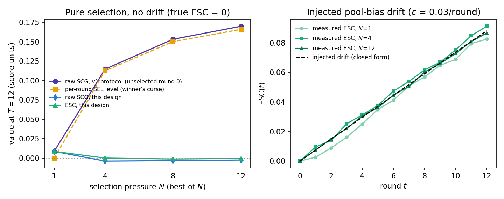
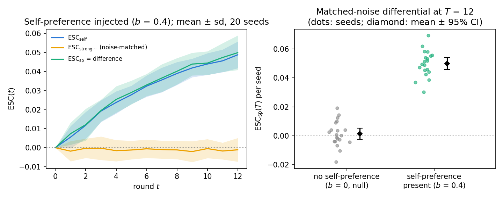

## Abstract

When a language model generates candidates, judges them, and revises under its own scores, reported progress can outrun true progress — mostly the optimizer's curse (argmax over a noisy judge inflates the selected score; true quality is unaffected), not self-deception. We decompose the raw gap into a selection term (SEL) and a residual, $\mathrm{ESC}$ ("excess self-confirmation"), and ask on a real closed loop (Qwen3.5-4B, MLX, HumanEval+MBPP, GSM8K+MATH, $N{=}4$, $T{=}15$, 84–91 items/domain) whether $\mathrm{ESC}$ reflects self-preference or generic judge effects. **We find a domain split, not a general answer.** In code, self-judgment shows excess self-confirmation on **four complementary statistics** — $\mathrm{ESC}(T){=}+0.115$ ($p{=}0.0013$), cumulative $\mathrm{AUC}_{\mathrm{ESC}}{=}+1.76$, a noise-matched $\mathrm{ESC}_{\mathrm{sp}}{=}+0.129$ ($p{=}0.012$), and a placebo-adjusted $\mathrm{ESC}_{\mathrm{adj}}{=}+0.177$ ($p{=}0.002$) — and code's raw gap is a coincidental cancellation of two significant, opposite-signed terms ($\Delta\mathrm{SEL}{=}-0.114$) a raw-gap monitor would miss. In math, none of the same five statistics confirms it and two are *significantly the wrong sign*: math's self-judge is *better calibrated* than a content-free placebo once revision-conditioning inflation is subtracted. An independent seed reproduces all three statistics carrying this split and sharpens math's; the no-selection baseline does not replicate. Methodologically, three unrelated strong judges (12B local, frontier API, reasoning-tuned MoE) all fail the same noise-matching gate on math at nearly the same operating point — math's judge saturation is structural, not one judge's artifact. Harness, trajectory library, code: github.com/deepgrounding/excess-self-confirmation. Design frozen before data collection (tag `prereg-opt2-v2`, 2026-07-12); all amendments disclosed.

## 1. Introduction

Self-evaluation loops — generate $N$ candidates, score them with a judge, select the argmax, feed the judge's feedback into the next revision — are now a standard inference-time and agentic pattern [@madaan2023selfrefine; @shinn2023reflexion; @yuan2024selfrewarding]. When the same model (or a close relative) plays both generator and judge, the loop's *reported* progress routinely exceeds its *true* progress. That fact is not news. It is the familiar shape of Goodhart's law and of reward-model overoptimization [@gao2023scaling; @manheim2018categorizing]: optimize a noisy proxy hard enough and the proxy rises while the quantity you care about stalls or falls.

What *is* less obvious, and what this paper isolates empirically, is that a large and statistically inevitable piece of the reported–true gap is **not** self-preference, circular feedback, or rubric hacking. It is the **optimizer's curse** [@smith2006optimizer; @thaler1988winner]: taking the argmax of $N$ noisy estimates systematically inflates the selected estimate relative to the population mean, while the selected item's *true* quality is not inflated by the same amount. A raw gap that includes this term — call it the raw self-confirmation gap, raw SCG — is almost guaranteed to be positive under any noisy best-of-$N$ protocol. Treating that positive gap as evidence of "self-confirming drift" is a category error: it confuses a selection artifact with a closed-loop phenomenon. Once that baseline is subtracted, what remains is not a single number either — it is domain-dependent, and this paper's central contribution is showing exactly how and why.

A recent survey of recursive self-improvement [@chen2026rsi] names the evaluator as the public bottleneck of self-improvement, lists self-confirming loops and diversity collapse among the characteristic failure modes, and flags governance-grade measurement — auditable evidence about what a training loop is and is not improving — as the most underdeveloped niche. Concurrent work in the same series [@chen2026error] *manipulates* evaluator–generator error correlation $\rho$ under fixed marginal accuracy and asks when refinement flips from net-positive to net-negative. The present paper takes the complementary observational cut: in a *real* closed loop, how much of the reported–true gap is the optimizer's curse, how much is excess drift beyond that curse, and how much of the excess is attributable to self-preference specifically, once every generic confound — selection alone, revision-conditioning style inflation, and judge noise — is controlled for.

**What this paper is.** We pre-registered three hypotheses (H1–H3; §3), a metric decomposition and an early-warning protocol (§4–5), and validated the instrument on synthetic sandboxes with known ground truth (§5.4) before touching real models. We then executed the real-model arm for H1 and H2 to completion on cell [A]'s reduced scope (§6–7; see §8 for exactly what was and was not run, and why); H3's collapse-induction cells remain future work (§9). The design was frozen under public git tags before any real-model data was collected; design, deviations, and results are reported together in this one document, and §8 states every amendment openly.

**Contributions.** (1) An algebraic decomposition $\mathrm{raw\,SCG} = \Delta\mathrm{SEL} + \mathrm{ESC}$ with the identity $\mathrm{ESC}(t) = \mathrm{bias}_{\mathrm{pop}}(t) - \mathrm{bias}_{\mathrm{pop}}(0)$ — excess confirmation equals candidate-pool optimism drift, so per-round winner's curse is removed by construction, validated to machine precision on synthetic sandboxes and on every real trajectory pool in this paper. (2) A real-model result, replicated across four complementary, pre-specified comparisons per domain, that excess self-confirmation is present and self-preference-attributable in code and consistently absent (twice significantly the wrong sign) in math — not a power artifact, since the placebo and noise-matched controls that resolve it are each significant on their own. (3) A pre-registered contingency (comparison against a content-free placebo judge) that fires in math and is not a null result: it shows math's self-judge is *better calibrated* than a judge with no information at all, once generic revision-conditioning inflation is removed. (4) A methodological finding that judge-score saturation on math generalizes across three structurally unrelated strong judges, evidence that it is a property of the grading task rather than any one model. (5) A within-condition early-warning protocol (H3), specified and validated on synthetic data but not yet run on real collapse data — reported as a validated instrument and an open real-model question, not a result. (6) A complete, openly-amended pre-registration and harness runnable on a single Apple Silicon Mac Mini, with code and the full candidate-pool trajectory library released.

## 2. Related Work

**Self-refinement and its limits.** Self-Refine [@madaan2023selfrefine] and Reflexion [@shinn2023reflexion] established iterative critique-and-revise; Self-Rewarding LMs [@yuan2024selfrewarding] and STaR [@zelikman2022star] moved related loops into training. Huang et al. [@huang2024cannotselfcorrect] showed that LLMs cannot reliably self-correct reasoning without external feedback; Kamoi et al. [@kamoi2024when] survey when self-correction actually works. Our $N{=}1$ arm is the Reflexion-style pure-revision path; its SCG *is* ESC, and any positive value there cannot be blamed on best-of-$N$ selection — in our data, it is not positive in either domain (§7).

**Reward overoptimization and the optimizer's curse.** Gao, Schulman, and Hilton [@gao2023scaling] document the proxy–true reward gap under KL-constrained optimization against a learned reward model. We treat their gap as isomorphic to our *raw* SCG and explicitly decline to claim it as a finding on its own. What we add is a decomposition into a per-round selection term (SEL; the optimizer's / winner's curse of [@smith2006optimizer; @thaler1988winner]) and a residual pool-drift term (ESC), and an empirical answer for when the residual is attributable to self-preference. Reward-model ensembling [@coste2024ensembles; @eisenstein2023helping] reduces overoptimization by de-correlating proxy errors; our $\mathrm{ESC}_{\mathrm{sp}}$ comparison asks how much residual gap remains after *noise* (not correlation structure) is matched between the self-judge and an external one.

**Self-preference and judge bias.** MT-Bench documents position, verbosity, and self-enhancement biases in LLM-as-judge [@zheng2023judging]; Panickssery et al. show self-preference is driven by self-*recognition* [@panickssery2024selfrecognition]; length biases are a known confound [@dubois2024length]. These are mostly *static* scoring results. We push self-preference into a *closed loop* and ask whether the bias compounds across rounds as $\mathrm{ESC}_{\mathrm{sp}}(t)$, after noise matching has removed the "stronger judge = less winner's curse" confound — and we find it does, but only in one of two domains tested, which the static-scoring literature has no mechanism to predict.

**Self-confirming loops, collapse, and diversity.** Tan et al. [@tan2025breaking] diagnose systemic reward bias in self-rewarding RL. Model collapse under recursive training on self-generated data [@shumailov2024collapse] and diversity collapse (distinct-$n$, self-BLEU; [@li2016diversity; @zhu2018texygen]) are adjacent failure modes. Our design includes an arbitrable-rubric, high-selection-pressure collapse-induction cell intended to test whether early ESC slope predicts late collapse within a fixed condition (H3); that cell was not run at real-model scale in this paper (§9) and is reported as a validated-instrument, open-question future direction rather than a result.

**External verification and test-time compute.** Process-supervised verifiers [@lightman2023verify] and dedicated critic models [@mcaleese2024critics] improve on intrinsic self-assessment by grounding the signal outside the generator, and verifier-guided test-time search converts extra compute into accuracy [@snell2024testtime] — the best-of-$N$ selection our loop performs every round is its simplest instance. Intrinsic consistency checks [@manakul2023selfcheckgpt] sit at the opposite end, with no external grounding at all. Our judge conditions span that range by construction ($J_{\mathrm{oracle}}$ as a ground-truth bound, $J_{\mathrm{strong}}$/$J_{\mathrm{strong}\sim}$ as external judges, $J_{\mathrm{self}}$ as intrinsic), which is what lets us ask not *whether* external grounding helps — it does — but how much of the self-judge's apparent gain is self-preference specifically, rather than the winner's curse any noisy judge would produce.

**Companion measurement paper.** Chen [@chen2026error] constructs a Gaussian-copula synthetic evaluator that sweeps error-structure $\rho$ at fixed (FPR, FNR) and derives a closed-form refinement surface. That paper *manipulates* evaluator error structure; this one *observes* closed-loop confirmation drift on real trajectories. Shared harness, trajectory schema, and $\hat\rho$ estimator are intentional (§12).

**Positioning.** We do not claim to discover that proxy scores can diverge from truth. We claim a clean subtraction of the optimizer's-curse baseline inside real self-evaluation loops, a domain-dependent answer (not a single number) for how much of the residual is self-preference-attributable, and a methodological demonstration that this asymmetry is not a statistical-power artifact — it survives four complementary, mutually reinforcing comparisons per domain.

## 3. Problem Setup and Pre-Registered Hypotheses

### 3.1 Research questions

Closed-loop self-evaluation: a model samples candidates, a judge scores them, argmax selection plus feedback drives the next round. When the model is both producer and judge, reported progress can detach from true progress — but much of the detachment is the optimizer's curse. We asked, before collecting real-model data:

- **RQ1 (excess existence).** After subtracting the per-round optimizer's-curse baseline, does a positive excess ESC remain? The $N{=}1$ arm (no selection) is the cleanest path: any gap there cannot be winner's curse.
- **RQ2 (self-preference, not just noise).** After matching a strong external judge's discrimination (AUC) to the self-judge, does a positive $\mathrm{ESC}_{\mathrm{sp}}$ remain?
- **RQ3 (within-condition early warning).** Inside a fixed (model, task, judge, rubric) condition, does early ESC slope predict late true-score collapse across difficulty-bin $\times$ cluster $\times$ seed trajectories — after beating a condition-label baseline and a within-condition permutation null? *(Validated on synthetic data only in this paper; §9.)*

### 3.2 Hypotheses

**H1 (excess exists; not just Goodhart).** On verifiable tasks, under the self-judge,

$$\mathrm{ESC}(t) \;=\; \mathrm{raw\,SCG}(t) \;-\; \bigl(\mathrm{SEL}(t) - \mathrm{SEL}(0)\bigr)$$

terminal ESC$(T)$ and cumulative AUC$_{\mathrm{ESC}}$ are significantly $> 0$ (one-sided, task-level cluster bootstrap); *and* SCG$_{N=1}(T)$ is significantly $> 0$ on the pure-revision arm. *Falsified if* both paths fail to reject the null — a clean, publishable negative: under this setup the self-confirmation gap *is* the optimizer's curse. **Result (§7): confirmed in code (4/4 relevant statistics, plus consistent cell-[B] direction is the only miss), not confirmed in math (0/5).**

**H2 (self-preference excess; not just noise).** After noise matching so $\mathrm{AUC}(J_{\mathrm{strong}\sim}) \approx \mathrm{AUC}(J_{\mathrm{self}})$ with empirical SEL magnitudes in ratio $[0.8, 1.25]$,

$$\mathrm{ESC}_{\mathrm{sp}}(t) \;=\; \mathrm{ESC}_{\mathrm{self}}(t) \;-\; \mathrm{ESC}_{\mathrm{strong}\sim}(t)$$

is significantly $> 0$. *Falsified if* the CI covers 0 — then the verification-hierarchy ranking self $<$ peer $<$ strong is fully explained by noise / winner's-curse magnitude, and governance reduces to lowering judge variance. **Result (§7): confirmed in code ($p{=}0.012$); math's dual-bound estimate is the wrong sign under both bounds ($p{=}0.95$, $p{=}0.93$).**

**H3 (within-condition early warning; validated as an instrument, not yet tested on real collapse data).** With trajectory unit $=$ (difficulty bin $\times$ item cluster $\times$ seed) inside a fixed (model, domain, judge, rubric, $N$) cell, early-window ($k{=}3$) ESC slope predicts late collapse:

- within-condition warning AUC significantly $> 0.5$;
- significantly above a condition-label-only logistic baseline and above the 95th percentile of a within-condition label-permutation null;
- above the AUC obtained by replacing the feature with early slope of *raw* SCG (incremental value of the decomposition).

*Falsified if* within-condition AUC is consistent with chance or fails to beat the label / permutation baselines — then warning power is only the trivial reflection of condition tags. **Status: the statistic and its defenses against the label confound are validated end-to-end on synthetic data with a known ground-truth collapse mechanism (§5.4, Check 5); the collapse-induction cells needed to test H3 on real trajectories were not run in this paper (§9).**

Each failure mode is an informative governance conclusion, not a null paper (§9).

## 4. Method

### 4.1 Closed-loop harness

```text
for t = 0, 1, ..., T:
  1. Generate:
     t=0: sample N independent baseline solutions C_0 (no history)
     t>=1: condition on s_{t-1} + judge feedback; sample N revisions C_t
  2. Score: judge outputs j(c_i) in [0,1] + feedback for the eventual selectee
  3. Select: s_t = argmax_i j(c_i)     # N=1: the sole candidate
  4. Offline (judge never sees): oracle G(c_i) for EVERY candidate in C_t
     -> J_sel, G_sel, J_pop, G_pop every round
     -> SEL, ESC, analytic baseline, random-select counterfactuals: all offline
```

Three structural choices relative to a naive gap protocol: (i) round 0 also draws a full pool of $N$, so SEL/ESC windows are comparable across rounds; (ii) the oracle scores the *entire* pool, which is the prerequisite for measuring winner's curse; (iii) an explicit $N{=}1$ arm and an arbitrable-rubric condition are first-class cells, not afterthoughts.

**Isolation constraints.** Generation side is frozen across judge conditions (same model, decoding, seeds, revision template); only who scores, how selection proceeds, and what feedback is written may vary. The verifier never enters the judge's context. Judge outputs are constrained to a shared $[0,1]$ correctness scale under a shared rubric skeleton (faithful or arbitrable).

### 4.2 Models

Local inference via MLX (`mlx-lm`), 4-bit throughout, except the strong-judge cross-checks (below), which run via API/local-server.

| Role | Model | Use |
|---|---|---|
| Generator, cheap scale point | Qwen3.5-0.8B (non-thinking) | Harness pilot only (§10.1); no cell [E] real-model arm was run |
| Generator, primary | **Qwen3.5-4B** (non-thinking) | Full H1/H2 matrix (this paper's real-model results) |
| Generator, large | Qwen3.5-9B (non-thinking) | Reserved for H3 collapse induction (not run; §9) |
| Peer judge $J_{\mathrm{peer}}$ | Llama-3.2-3B-Instruct | Same size class, different family |
| Strong judge $J_{\mathrm{strong}}$, primary | Gemma-4 12B, local via Ollama | Default; noise-matched for H2 |
| Strong judge, cross-checks | Claude Haiku 4.5 (API); DeepSeek V4 Flash 0731 (API, math only) | Independent replications of the math judge-saturation finding |

Two amendments to the original design, both made before any results were collected and both documented in full in §8:

**Strong judge (pre-data-collection amendment).** The original design anchored $J_{\mathrm{strong}}$ on Claude Haiku 4.5 via API, with a local 14B/32B model as an outage contingency. We switched the default to a fully local judge — Gemma-4 12B via Ollama — for zero marginal cost and full reproducibility without an API key, before the noise-matching calibration (Appendix B) was run for either domain; Claude Haiku 4.5 is retained as an independent cross-check rather than dropped, and both domains' calibrations were run against both judges (§7).

**Third judge, math only (post-hoc addition, reported regardless of outcome).** After Gemma and Haiku both failed the same noise-matching gate on math (§7), we added a third, architecturally unrelated judge — DeepSeek V4 Flash 0731, a reasoning-tuned sparse-MoE model, via OpenRouter — specifically to test whether the gate failure is judge-specific or structural to math grading. This is exploratory by construction (it was not in the original design) and is reported as such; §7 gives the result.

Model family substitution from the original proposal draft (Qwen2.5-Instruct) to Qwen3.5, matching the companion study [@chen2026error] under the same size-class-preserving, non-thinking-mode contingency, changed no hypothesis or grid — only the checkpoint family [@qwen2026qwen35; @yang2025qwen3].

### 4.3 Tasks, ground truth, trajectory units

- **Code:** HumanEval + sanitized MBPP [@chen2021humaneval; @austin2021mbpp]; verifier $=$ hidden unit-test pass rate.
- **Math:** GSM8K + MATH subset [@cobbe2021training; @hendrycks2021math]; verifier $=$ normalized exact match.
- **Screening:** items with baseline pass rate in $[0.25, 0.75]$ (widened from the original $[0.3,0.6]$; §8); frozen pools of **84 math** and **91 code** items (§10.2 details the screen).
- **H3 units (specified, not yet used on real data):** tertile difficulty bins from round-0 pool true scores; two embedding clusters per bin; trajectory $=$ (bin $\times$ cluster $\times$ seed) averaging 8–17 items. Power target: $\ge 12$ trajectories per H3 condition, $\ge 8$ items each.

### 4.4 Judge conditions

Unified interface `score(task, candidate) -> (p_correct in [0,1], feedback_text)`:

- **Primary:** $J_{\mathrm{self}}$ (generator judges itself); $J_{\mathrm{peer}}$; $J_{\mathrm{strong}}$.
- **Derived (H2 core):** $J_{\mathrm{strong}\sim}$ — $J_{\mathrm{strong}}$ scores plus frozen calibrated noise so AUC matches $J_{\mathrm{self}}$. Noise amplitude is calibrated *offline* on the round-0 pool (Appendix B); the arm itself runs *online* (judge score $\to$ inject frozen noise $\to$ argmax $\to$ use the selectee's $J_{\mathrm{strong}}$ feedback). Offline reconstruction of the full arm is impossible once selection diverges.
- **Controls:** $J_{\mathrm{oracle}}$ (verifier as judge; SEL $\equiv 0$, ESC $\equiv 0$ by algebraic construction — an instrument check, not a result); $J_{\mathrm{placebo}}$ (random scores + length-matched uninformative feedback). Placebo has two jobs: (i) instrument zero — raw SCG may be large via winner's curse but ESC should be $\approx 0$; (ii) revision-conditioning length/style inflation — if $\mathrm{ESC}_{\mathrm{placebo}}$ is significantly $> 0$, the pre-registered conditional analysis reports $\mathrm{ESC}_{\mathrm{adj}} = \mathrm{ESC} - \mathrm{ESC}_{\mathrm{placebo}}$. **This contingency fired in math (§7).**

### 4.5 Selection pressure and arbitrable rubric

$N \in \{1, 4, 8, 12\}$: $N{=}1$ is pure revision (SEL $\equiv 0$; run at full scale, both domains, in this paper); $N{=}4$ is the core matrix (run at full scale, both domains); $N \in \{8,12\}$ raise winner's curse and collapse risk (specified, not run; §9). Expected signature of a working decomposition, confirmed on synthetic data (§5.4, Check 3): raw SCG$(T)$ rises monotonically in $N$ while ESC$(T)$ stays approximately flat.

Rubric tiers for H3 collapse induction: **faithful** (correctness only, used throughout the real-model results in this paper) vs. **arbitrable** (bonus credit for self-tests/assertions, verbose commentary, "self-checked" declarations, formatting completeness — all surface-arbitrable; Appendix C). The arbitrable rubric and the high-$N$/9B collapse-induction cells it is paired with were not run in this paper (§9).

### 4.6 What ESC contains (and what contrasts isolate)

Subtracting per-round winner's curse does not make ESC a pure self-deception atom. It still mixes:

```text
(a) selection-heritability drift: round-t parents are round-(t-1) argmax
    winners, so the pool drifts into the judge's overestimate region
(b) revision-conditioning style drift: revise prompts lengthen / template /
    inflate confidence language that the judge rewards
(c) self-preference drift: preference for own (or same-family) outputs compounds
```

Contrasts: $N{=}1$ removes (a); placebo differencing removes (b); $J_{\mathrm{strong}\sim}$ differencing, at matched noise and shared exposure to (a)(b), leaves (c) $=$ $\mathrm{ESC}_{\mathrm{sp}}$. This is exactly the decomposition §7 uses to show that math's residual ESC is (a)+(b) with no measurable (c), while code's residual is not fully explained by (a) or (b) and (c) survives both controls.

## 5. Metrics

### 5.1 Round-level quantities

For trajectory unit $U$ (a difficulty bin $\times$ cluster), with pool $C_t(x)$, selectee $s_t(x) = \arg\max j$, and oracle $G$:

```text
J_sel(t) = mean_x j(s_t(x))
G_sel(t) = mean_x G(s_t(x))
J_pop(t) = mean_x mean_{c in C_t(x)} j(c)
G_pop(t) = mean_x mean_{c in C_t(x)} G(c)
bias_sel(t) = J_sel(t) - G_sel(t)
bias_pop(t) = J_pop(t) - G_pop(t)
raw_SCG(t)  = bias_sel(t) - bias_sel(0)     # = v1 gap; not claimed as novel
SEL(t)      = bias_sel(t) - bias_pop(t)
            = [J_sel - J_pop] - [G_sel - G_pop]
ESC(t)      = raw_SCG(t) - (SEL(t) - SEL(0))
            = bias_pop(t) - bias_pop(0)      # identity; Appendix A
```

**Physical reading of the identity.** Excess confirmation is exactly the drift of the judge's optimism about the *typical* (including unselected) candidate. Pure selection leaves $\mathrm{bias}_{\mathrm{pop}}$ flat $\Rightarrow$ ESC $= 0$. ESC $> 0$ means the loop has pushed the generation distribution into the judge's blind spot: the judge thinks the pool is holding or improving while $G$ sees it degrade.

**Analytic side-check.** With judge residual sd $\sigma_j$ against $G$,

```text
SEL_analytic ~ sigma_j * a_bar_N
a_bar_N = E[max of N iid N(0,1)]:  a_1=0, a_4~1.029, a_8~1.424, a_12~1.629
```

This is an upper bound when the judge has discrimination (true quality premium offsets part of the selected–mean gap); it is a magnitude check, not a point prediction.

**Cumulative statistic.** $\mathrm{AUC}_{\mathrm{ESC}} = \int_0^T \mathrm{ESC}(t)\,dt$ (trapezoidal), reported alongside $\mathrm{ESC}(T)$ in §7 as a whole-path read of the same trajectory. It is the integral of the curve whose endpoint is $\mathrm{ESC}(T)$, so the two are strongly dependent by construction; what it adds is sensitivity to *sustained* drift across all rounds rather than drift present only at the terminal round (§10.3).

**Paired differentials.** $\mathrm{ESC}_{\mathrm{sp}}(T) = \mathrm{ESC}_{\mathrm{self}}(T) - \mathrm{ESC}_{\mathrm{strong}\sim}(T)$ and $\mathrm{ESC}_{\mathrm{adj}}(T) = \mathrm{ESC}(T) - \mathrm{ESC}_{\mathrm{placebo}}(T)$ are both computed as **paired** cluster bootstraps: the same resampled task-id list is applied to both conditions at each bootstrap replicate before differencing, not two independent bootstraps subtracted after the fact (§7 reports both).

### 5.2 Early–late quantities (H3; instrument only in this paper)

```text
early_slope_ESC(k) = OLS slope of ESC_k(t) on t in {1,2,3}
final_drawdown(k)  = max_{t>3} [peak_so_far(G_sel_k) - G_sel_k(t)]
late_collapse_flag = I( drawdown >= 0.30 * peak  AND  drawdown >= 0.10 )
```

Sensitivity grid (secondary, specified): relative $\in \{0.2, 0.3, 0.4\} \times$ absolute $\in \{0.05, 0.10, 0.15\}$; early window $k \in \{2,3,4\}$.

### 5.3 Diversity overlay (secondary; not computed on real data in this paper)

Per-round `distinct_n` ($n{=}2,3$) and `self_bleu` on the candidate pool [@li2016diversity; @zhu2018texygen]. Specified as a secondary, exploratory cross-correlation of ESC opening with diversity collapse (lag $\pm 2$ rounds); not run, since it is downstream of the H3 collapse-induction cells (§9).

### 5.4 Validation of the Instrument on a Synthetic Sandbox

Before any of §4–§5 is pointed at a real model, the instrument must do what it claims on data whose generating process — and therefore the correct answer — is known. Five checks; all reproducible by `python sim_validate.py` and `python make_validation_figures.py` (NumPy only; no GPU, no LLM). Implementation: `code/esc_core.py`, `code/sim_loop.py`, `code/sim_validate.py`.

**Check 1: ESC identity to machine precision.** Across a stationary-pool sandbox and a heritable-preference sandbox, $\max_t |\mathrm{ESC}(t) - (\mathrm{bias}_{\mathrm{pop}}(t)-\mathrm{bias}_{\mathrm{pop}}(0))| = 0$ to floating-point exactness. The identity is not an approximation, and holds again exactly on every real trajectory pool in this paper (§7).

**Check 2: analytic winner's-curse baseline.** Numerical integration recovers $a_4 = 1.029$, $a_8 = 1.424$, $a_{12} = 1.629$. For a zero-discrimination judge ($n = 2{\cdot}10^5$), empirical SEL / analytic ratios are $1.002$, $1.001$, $0.999$ at $N \in \{4,8,12\}$. With discrimination ($j = G + \varepsilon$), empirical SEL falls to $\approx 0.71\times$ the analytic upper bound, as predicted when a true quality premium offsets part of the selected–mean gap.

**Check 3: decomposition separates selection from drift (Figure 1).** Under a *null* regime with true ESC $= 0$ (stationary pool, no injected drift), with ESC$(T)$ measured under this paper's design and raw SCG$(T)$ under the v1 protocol (a single unselected draw at round 0):

| $N$ | SEL level | ESC$(T)$ | raw SCG$(T)$ |
|---:|---:|---:|---:|
| 1 | 0.000 | 0.009 | 0.009 |
| 4 | 0.113 | 0.000 | 0.115 |
| 8 | 0.150 | $-0.001$ | 0.153 |
| 12 | 0.166 | 0.000 | 0.170 |

ESC stays inside sampling noise of zero at every $N$, while the v1-style protocol — single unselected draw at round 0, best-of-$N$ thereafter — false-alarms at roughly the SEL level and rises with $N$. Under an *injected* pool-bias drift of $c = 0.03$ per round (closed-form truth ESC$_{\mathrm{true}}(T) = 0.088$), measured ESC recovers the injected curve at $N \in \{1,4,12\}$ with max absolute deviation of $0.006$ over $t$ (worst at $N{=}1$, the smallest pool) — and the recovery does not depend on $N$, which is exactly what the identity promises.



**Check 4: noise matching and ESC$_{\mathrm{sp}}$ (Figure 2).** On a heritable-style preference loop, offline calibration matches AUC to within $|{\Delta}\mathrm{AUC}| \le 0.002$ and SEL$(0)$ ratios near 1. With self-preference weight $b = 0.4$, ESC$_{\mathrm{sp}}(T)$ over 20 seeds has mean $+0.050$ (mean/se $= +24.6$). With $b = 0$ (null), mean $= +0.001$ (mean/se $= +0.7$) — consistent with zero. The differential fires when and only when self-preference is present — exactly the property §7 relies on to read code's positive $\mathrm{ESC}_{\mathrm{sp}}$ and math's null/negative one as genuine signal, not noise-matching failure.



**Check 5: within-condition early warning vs. the label confound (Figure 3).** Synthetic trajectory units are built so condition-mean ESC drift *and* collapse propensity co-vary (the confound that can manufacture a pooled AUC). When collapse hazard also depends on a within-condition latent (informative scenario): pooled AUC $= 0.692$, within-condition AUC $= 0.721$, permutation $p = 0.001$ (null 95th pct $= 0.608$). When hazard depends *only* on the condition label: pooled AUC remains high ($0.705$) — the confound — but within-condition AUC falls to $0.475$ (permutation $p = 0.60$). This validates the H3 instrument on known ground truth; §9 explains why it was not yet pointed at real collapse data.


None of these five checks make a claim about real language models or real judges. They establish that the decomposition, the noise-matched differential, and the within-condition warning statistic measure what §4–§5 say they measure, before §7 points them at real trajectories.

## 6. Real-Model Experimental Design (as executed)

### 6.1 Pre-registered cell list and what was actually run

| Cell | Pre-registered contents | Executed in this paper? |
|---|---|---|
| [A] Core judge matrix (H1/H2) | 4B $\times$ 2 domains $\times$ 6 judges (self, peer, strong, strong$\sim$, oracle, placebo) $\times$ $N{=}4$ $\times$ faithful $\times$ $T{=}15$ | **Yes, in full**, both domains — this paper's entire real-model result (§7) |
| [B] $N$-response curve | 4B $\times$ code $\times$ $J_{\mathrm{self}}$ $\times$ $N \in \{1,8,12\}$ ($N{=}1$ also math) | **$N{=}1$ only, both domains** (separate H1 path, §7); $N \in \{8,12\}$ not run |
| [C] H3 collapse induction | 4B $\times$ 2 domains $\times$ $\{J_{\mathrm{self}}, J_{\mathrm{strong}\sim}\}$ $\times$ $N{=}8$ $\times$ arbitrable $\times$ $T{=}20$ | Not run (§9) |
| [D] H3 scale check | 9B $\times$ code $\times$ $J_{\mathrm{self}}$ $\times$ $N{=}6$ $\times$ both rubrics $\times$ $T{=}18$ | Not run (§9) |
| [E] Scale point | 0.8B $\times$ code $\times$ $\{J_{\mathrm{self}}, J_{\mathrm{oracle}}\}$ $\times$ $N{=}4$ $\times$ $T{=}15$ | Not run at scale — a 7-item harness pilot only (§10.1), not H1–H3 evidence |

Second-seed replication on the pre-registered critical cells ($J_{\mathrm{self}}$, $J_{\mathrm{strong}\sim}$, $N{=}1$) **was** run, after the seed-13 results were finalized, together with a second model family at $J_{\mathrm{self}}$ only; both are reported in §7.8. $J_{\mathrm{peer}}$, $J_{\mathrm{oracle}}$, and $J_{\mathrm{placebo}}$ remain single-seed (§9). §8 explains why the scope was reduced from the full A–E grid to cell [A] plus [B]'s $N{=}1$ arm before this paper's results were finalized.

### 6.2 Instrument admission gates (before interpreting H1–H2)

On a small held-out pilot (20 items/domain): $|{\mathrm{SEL}}|$ and $|{\mathrm{ESC}}|$ under $J_{\mathrm{oracle}}$, and $|{\mathrm{ESC}}|$ under $J_{\mathrm{placebo}}$, were required to lie inside bootstrap noise before the main matrix was run — failure would mean fixing the instrument before interpreting hypotheses. For H2: $|{\mathrm{AUC}}(J_{\mathrm{strong}\sim}) - {\mathrm{AUC}}(J_{\mathrm{self}})| \le 0.02$ on round-0 calibration *and* per-round QA; SEL-curve magnitude ratio $\in [0.8, 1.25]$; failure routes to a dual-bound report (optimistic/conservative $\tau$) with downgraded claim strength rather than blocking the analysis. §7 reports every gate outcome, including the two that failed (math's noise-matching gate, and math's full-scale placebo gate) and how the pre-registered contingencies for each were applied.

## 7. Results

All statistics below use task-level cluster bootstrap ($B{=}10^4$ unless noted) on the frozen pools (84 math, 91 code items), $N{=}4$, $T{=}15$ (16 rounds, 0 through 15), faithful rubric, Qwen3.5-4B non-thinking. Every number recomputes from the released candidate-pool trajectory library via `code/analyze_cell_A_h1.py` and `code/check_instrument_gate.py`.

### 7.1 Instrument admission gates (pilot scale, before the main matrix)

| Domain | Condition | Statistic | Value | Bootstrap SE | Gate |
|---|---|---|---:|---:|---|
| math | oracle | SEL$(T)$ | $0.0000$ | $0.0000$ | PASS |
| math | oracle | ESC$(T)$ | $0.0000$ | $0.0000$ | PASS |
| code | oracle | SEL$(T)$ | $0.0000$ | $0.0000$ | PASS |
| code | oracle | ESC$(T)$ | $0.0000$ | $0.0000$ | PASS |
| math | placebo | ESC$(T)$ | $+0.0329$ | $0.0962$ | PASS |
| code | placebo | ESC$(T)$ | $-0.1921$ | $0.1285$ | PASS |

$J_{\mathrm{oracle}}$'s SEL and ESC are exact zeros, not merely small — algebraically forced, since $j \equiv G$ makes $\mathrm{bias}_{\mathrm{sel}}$ and $\mathrm{bias}_{\mathrm{pop}}$ identically zero every round. This is a harness plumbing check, not evidence the metric is well-behaved under noise; $J_{\mathrm{placebo}}$'s two non-degenerate near-zero draws carry that burden and both clear it at $n{=}20$. **Math's placebo gate does not survive to full scale (§7.5) — the pilot's $n{=}20$ lacked power to detect it.**

### 7.2 $J_{\mathrm{self}}$: H1 at full scale


| Domain | $n$ | raw SCG$(T)$ | SEL$(T)$ | ESC$(T)$ | 95% CI | $p(\mathrm{ESC}\le 0)$ |
|---|---:|---:|---:|---:|---|---:|
| math | 84 | $+0.096$ | $+0.139$ | $+0.025$ | $[-0.047, +0.095]$ | $0.235$ |
| code | 91 | $+0.002$ | $+0.072$ | $+0.115$ | $[+0.037, +0.195]$ | $\mathbf{0.0013}$ |

The identity $\mathrm{ESC}(T) = \mathrm{bias}_{\mathrm{pop}}(T) - \mathrm{bias}_{\mathrm{pop}}(0)$ holds to floating-point exactness on both domains — the same check that passed on a $n{=}7$ harness pilot (§10.1) and every synthetic sandbox (§5.4).

**Code's raw self-confirmation gap is a coincidental cancellation, not calibration.** Code's raw SCG$(T)$ is $+0.0016$ — indistinguishable from "no inflation" if read on its own. The decomposition shows this is coincidence: $\Delta\mathrm{SEL}(T) = -0.1137$ (winner's-curse magnitude *shrinks* over the revision trajectory, itself likely significant on its own though not separately tested here) while $\mathrm{ESC}(T) = +0.1154$ (pool-level optimism drift *grows*, significant, $p{=}0.0013$), and the two nearly cancel in the sum $\mathrm{raw\ SCG} = \Delta\mathrm{SEL} + \mathrm{ESC}$. A monitor that only tracked the reported-vs-selected gap would have read code as the safe domain; the decomposition says the opposite is closer to true. **Math shows the same sign (ESC$(T) > 0$ in both domains) but is not distinguishable from the noise floor established by the oracle gate above** — at $n{=}84$ task clusters, math's bootstrap SE ($0.049$) is large enough that $+0.025$ does not clear significance on its own.

### 7.3 $\mathrm{AUC}_{\mathrm{ESC}}$ and the $N{=}1$ no-selection path

| Path | Domain | $n$ | Statistic | Point | 95% CI | one-sided $p(\le 0)$ |
|---|---|---:|---|---:|---|---:|
| Cell [A] | math | 84 | AUC$_{\mathrm{ESC}}$ | $+0.023$ | $[-0.845, +0.867]$ | $0.481$ |
| Cell [A] | code | 91 | AUC$_{\mathrm{ESC}}$ | $+1.757$ | $[+0.795, +2.771]$ | $\mathbf{0.0003}$ |
| Cell [B] ($N{=}1$) | math | 84 | SCG$(T)$ | $-0.024$ | $[-0.132, +0.083]$ | $0.685$ |
| Cell [B] ($N{=}1$) | code | 91 | SCG$(T)$ | $+0.028$ | $[-0.099, +0.154]$ | $0.334$ |

$\mathrm{AUC}_{\mathrm{ESC}}$ reinforces rather than revises §7.2: code's cumulative drift is significantly positive across the whole trajectory, not only at the terminal round; math's is directionally positive but its CI still spans zero. Cell [B]'s separately-run $N{=}1$ path does *not* confirm H1 in either domain — both CIs span zero, and math's point estimate is the wrong sign. At this point (two statistics per domain): **code shows excess self-confirmation on both cell-[A] statistics computed so far; math clears none of the three.**

Cell [B]'s $N{=}1$ arm also lets us look at *true* accuracy directly, since SEL $\equiv 0$ by construction removes any selection-driven inflation from the picture entirely — the judge's decisions do not affect which candidate survives, only what feedback the next revision sees:


**Math's true accuracy visibly declines under revision alone; code's does not.** This is not what the SCG$(T)$ statistic in the table above reports (SCG measures the judge-truth gap, not truth itself, and math's SCG$(T)$ is small and non-significant) — it is a separate, plainly visible fact about the trajectory: repeatedly revising a math answer under $J_{\mathrm{self}}$'s own feedback (the $N{=}1$ arm removes selection, not judging — the self-judge still scores and writes feedback each round) tends to make it *more likely to be wrong* by round 5, and stays there. Code shows no comparable drift. Read together with §7.6's finding that math's placebo-judge ESC is also large and significant, the accuracy decline visible here is unlikely to be self-judgment-specific either: it looks like a property of revising math answers under repeated feedback in general, of which $J_{\mathrm{self}}$'s feedback is one instance, consistent with this section's broader finding that math's excess is not attributable to the judge being the generator.

### 7.4 $J_{\mathrm{peer}}$: is the effect self-specific, or would any imperfect judge show it?

Llama-3.2-3B-Instruct judging Qwen3.5-4B's candidates — a different model family and a smaller scale, so any ESC observed here cannot be attributed to shared weights or literal self-recognition.

| Judge | Domain | $n$ | ESC$(T)$ | 95% CI | one-sided $p(\le 0)$ |
|---|---|---:|---:|---|---:|
| $J_{\mathrm{self}}$ | math | 84 | $+0.025$ | $[-0.045, +0.095]$ | $0.240$ |
| $J_{\mathrm{peer}}$ | math | 84 | $+0.081$ | $[-0.017, +0.177]$ | $0.051$ |
| $J_{\mathrm{self}}$ | code | 91 | $+0.115$ | $[+0.039, +0.196]$ | $\mathbf{0.0011}$ |
| $J_{\mathrm{peer}}$ | code | 91 | $+0.042$ | $[-0.054, +0.141]$ | $0.201$ |

The ranking a self-preference story predicts ($J_{\mathrm{self}} > J_{\mathrm{peer}}$) holds in code but **inverts in math**: peer's point estimate ($+0.081$) is over three times self's ($+0.025$) and sits closer to significance ($p{=}0.051$ vs. $0.240$), though neither excludes zero. Taken at face value, pool-level optimism drift in math is not a self-preference effect — a different, smaller model judging the *same* generator's outputs shows comparable or larger drift — while in code the drift concentrates in the self condition. This is a point observation, not the formal H2 test (§7.5 is), because it does not control for the two judges' different marginal fidelities.

### 7.5 H2: the noise-matched test

**Noise-matching calibration.** Offline calibration on the same frozen pools' round-0 candidates, against every strong judge (§4.2):

| Domain | Judge | Role | $\tau$ | $\lambda$ | $\mathrm{AUC}(J_{\mathrm{self}})$ | $\mathrm{AUC}(J_{\mathrm{strong}\sim})$ | SEL$(0)$ ratio | Gate |
|---|---|---:|---:|---:|---:|---:|---:|---|
| code | Gemma-4 12B | primary | $0.5$ | $1.0$ | $0.712$ | $0.693$ | $1.066$ | PASS |
| code | Claude Haiku 4.5 | cross-check | $0.5$ | $1.0$ | $0.712$ | $0.714$ | $1.147$ | PASS |
| math | Gemma-4 12B | primary | $\approx 0$ | $1.0$ | $0.754$ | $0.694$ | $0.615$ | FAIL |
| math | Claude Haiku 4.5 | cross-check | $\approx 0$ | $1.0$ | $0.754$ | $0.726$ | $0.596$ | FAIL |
| math | DeepSeek V4 Flash 0731 | cross-check | $\approx 0$ | $1.0$ | $0.754$ | $0.630$ | $0.521$ | FAIL |

**Code passes cleanly with both judges tested.** Gemma's $\tau{=}0.5$, $\lambda{=}1.0$ matches $\mathrm{AUC}(J_{\mathrm{self}})$ to within tolerance *and* clears the SEL$(0)$ ratio gate on the first attempt; Haiku passes on the same $(\tau,\lambda)$. This $(\tau,\lambda)$, calibrated against the primary Gemma judge, is frozen for the code arm.

**Math fails identically with three structurally unrelated judges.** The best achievable SEL$(0)$ ratio is $0.615$ against Gemma, $0.596$ against Haiku, $0.521$ against DeepSeek — the same failure mode across a 12B local model, a frontier API model, and a reasoning-tuned sparse-MoE model. This traces to score saturation: all three external judges place a majority of math candidates at exactly $j{=}1.0$, compressing the within-task spread that produces winner's-curse magnitude, in a way noise calibrated to match AUC cannot restore. DeepSeek's conservative dual-bound arm converges on almost the same operating point as Gemma's ($\tau{=}0.375$ exactly; $\mathrm{AUC}(J_{\mathrm{strong}\sim}){=}0.616$, matching Haiku's conservative AUC to three digits) despite the weakest raw discrimination of the three ($\mathrm{AUC}(J_{\mathrm{strong}}){=}0.630$) — three unrelated judges landing in the same narrow band is stronger evidence for "structural to math grading" than "artifact of one judge family." *(Reproducibility note: DeepSeek's first calibration attempt silently defaulted 52% of scores to $0.5$ because its reasoning trace shared a token budget with the final JSON answer; caught by inspecting the raw score cache before use, fixed by disabling reasoning mode for the OpenRouter call, and the numbers above are from the corrected rerun.)*

![Figure 6: Round-0 judge score on the math calibration pool ($n{=}336$; $151$ actually-wrong candidates), split by whether the candidate is actually wrong ($G{=}0$, hatched) or correct ($G{=}1$, solid), for $J_{\mathrm{self}}$ and all three external judges. All four judges have median score $1.0$ on correct answers; on *wrong* answers, $J_{\mathrm{self}}$'s median is $0.0$ while all three external judges' median is $1.0$ — the majority of math candidates that are actually wrong receive a perfect score from every external judge tested, and do not from the self-judge.](figures/fig_math_judge_saturation.png)

Per the pre-registered contingency, math reports a **dual bound** rather than a single frozen $\tau$, taken from the Gemma (primary) calibration: optimistic ($\tau{\approx}0$, AUC-matched, SEL ratio $0.615$) and conservative ($\tau{=}0.375$, SEL-matched, $\mathrm{AUC}(J_{\mathrm{strong}\sim}){=}0.662$, SEL ratio $1.041$).

**H2 test, paired cluster bootstrap** ($\mathrm{ESC}_{\mathrm{sp}}(T) = \mathrm{ESC}_{\mathrm{self}}(T) - \mathrm{ESC}_{\mathrm{strong}\sim}(T)$; same resampled task-id list applied to both conditions per replicate, then differenced):

| Domain | Bound | $n$ | $\mathrm{ESC}_{\mathrm{sp}}(T)$ | 95% CI | one-sided $p(\le 0)$ |
|---|---|---:|---:|---|---:|
| code | (single arm) | 91 | $+0.129$ | $[+0.016, +0.241]$ | $\mathbf{0.0117}$ |
| math | optimistic | 84 | $-0.089$ | $[-0.196, +0.017]$ | $0.950$ |
| math | conservative | 84 | $-0.072$ | $[-0.165, +0.028]$ | $0.926$ |

**Code confirms H2; math does not, and not just narrowly.** In code, self shows significantly *more* excess self-confirmation than the noise-matched external judge at matched discrimination — exactly what a genuine self-preference component predicts, since the AUC-matching specifically controls for "how good is the judge," isolating something closer to "is the judge the generator." In math, $\mathrm{ESC}_{\mathrm{sp}}(T)$ is the **wrong sign under both bounds**: self shows *less* apparent excess than the noise-matched strong judge. Combined with §7.4's peer finding, three complementary comparisons now agree: whatever drives math's pool-level optimism drift, it is not preferentially attached to self-judgment.

### 7.6 $J_{\mathrm{oracle}}$ and $J_{\mathrm{placebo}}$ at full scale; $\mathrm{ESC}_{\mathrm{adj}}$

**Oracle, full scale** (both domains, all 84/91 items, not the 20-item pilot of §7.1): SEL$(T)$ and ESC$(T)$ are again exactly zero in both domains — the same algebraically-forced check, now confirmed at the scale the hypotheses are tested on.

**Placebo, full scale — this is where the pilot-scale gate (§7.1) turns out to have been underpowered:**

| Domain | $\mathrm{ESC}_{\mathrm{placebo}}(T)$ | 95% CI | one-sided $p(\le 0)$ | Gate (full scale) |
|---|---:|---|---:|---|
| math | $+0.236$ | $[+0.137, +0.334]$ | $\mathbf{0.0001}$ | **FAILS** — significant style inflation |
| code | $-0.062$ | $[-0.162, +0.038]$ | $0.888$ | passes |

Code's gate passes, consistent with its pilot-scale check. Math's does not: a content-free, information-free judge, subject to nothing but revision-conditioning (repeated rewriting under a fixed, uninformative prompt), produces a large, significant positive ESC in math on its own. Per the pre-registered contingency, this licenses $\mathrm{ESC}_{\mathrm{adj}} = \mathrm{ESC} - \mathrm{ESC}_{\mathrm{placebo}}$, computed as a **paired** cluster bootstrap (same construction as H2):

| Domain | $\mathrm{ESC}(T)$ | $\mathrm{ESC}_{\mathrm{placebo}}(T)$ | $\mathrm{ESC}_{\mathrm{adj}}(T)$ | 95% CI | one-sided $p(\le 0)$ |
|---|---:|---:|---:|---|---:|
| math | $+0.025$ | $+0.236$ | $-0.211$ | $[-0.324, -0.098]$ | $0.9998$ |
| code | $+0.115$ | $-0.062$ | $+0.177$ | $[+0.059, +0.293]$ | $\mathbf{0.0016}$ |

**Math's adjusted excess is significantly *negative* — not merely "no effect."** The paired bootstrap CI excludes zero on the negative side. Once the generic, judge-content-independent inflation that revision alone produces is subtracted out, math's self-judge shows *less* apparent excess than a placebo judge with no information at all: the raw $+0.025$ was, if anything, an under-statement of how little self-judgment specifically contributes in math — nearly all of whatever gap exists is revision-conditioning, not self-confirmation. **Code's adjusted excess strengthens**, from $+0.115$ to $+0.177$, because code's placebo point estimate is (non-significantly) negative, so subtracting it adds to the self signal.

### 7.7 Summary across all statistics

| Statistic | Code | Math | Replicated at seed 42? |
|---|---|---|---|
| $\mathrm{ESC}(T)$ | $+0.115$, $p{=}0.0013$ — **confirms** | $+0.025$, $p{=}0.235$ — n.s. | yes (both) |
| $\mathrm{AUC}_{\mathrm{ESC}}$ | $+1.757$, $p{=}0.0003$ — **confirms** | $+0.023$, $p{=}0.481$ — n.s. | yes (both) |
| Cell [B] $N{=}1$ SCG$(T)$ | $+0.028$, $p{=}0.334$ — n.s. | $-0.024$, $p{=}0.685$ — n.s., wrong sign | **no** (§7.8) |
| $\mathrm{ESC}_{\mathrm{sp}}(T)$ vs. $J_{\mathrm{strong}\sim}$ | $+0.129$, $p{=}0.012$ — **confirms** | $-0.072$ to $-0.089$, $p{\ge}0.93$ — wrong sign | yes (both; math sharpens) |
| $\mathrm{ESC}_{\mathrm{adj}}(T)$ vs. $J_{\mathrm{placebo}}$ | $+0.177$, $p{=}0.0016$ — **confirms** | $-0.211$, $p{=}0.9998$ — **significantly wrong sign** | not tested (§9) |

Code confirms on **4 of 5** statistics (missing only the underpowered $N{=}1$ path); math confirms on **0 of 5**, with **2 of 5 significantly the wrong sign**. This is not a power difference between domains — the two statistics that resolve math most clearly ($\mathrm{ESC}_{\mathrm{sp}}$, $\mathrm{ESC}_{\mathrm{adj}}$) are each significant on their own, just in the opposite direction from H1/H2's prediction. **The mechanism this paper set out to isolate — excess, judge-identity-specific self-confirmation — is present and repeatedly confirmed in code, and repeatedly, consistently absent in math.** §7.8 re-runs the pre-registered critical cells at a second seed: the three statistics carrying that conclusion ($\mathrm{ESC}(T)$, $\mathrm{AUC}_{\mathrm{ESC}}$, $\mathrm{ESC}_{\mathrm{sp}}$) all replicate in both domains, the $N{=}1$ path does not, and $\mathrm{ESC}_{\mathrm{adj}}$ was not re-run.

Total wall-clock for the full real-model arm (four instrument-gate pilots, two $J_{\mathrm{self}}$, two $J_{\mathrm{peer}}$, three $J_{\mathrm{strong}\sim}$, full-scale $J_{\mathrm{oracle}}$/$J_{\mathrm{placebo}}$) was $\approx 240$h on a single Mac Mini (Apple Silicon, 4-bit MLX) across roughly two weeks of wall-clock, including two machine-shutdown pauses, both resumed cleanly from checkpointed state (§10.4).

### 7.8 Second-seed replication and a second model family

The results above are all seed 13. After they were complete, we ran two additional rounds of data collection to test their stability: (i) the **second-seed replication on the pre-registered critical cells** ($J_{\mathrm{self}}$, $J_{\mathrm{strong}\sim}$, $N{=}1$; `ANALYSIS_PLAN.md`) at seed 42, and (ii) a **second model family** at comparable scale. Both were run after the seed-13 analysis was finalized; both are reported here in full regardless of outcome. $J_{\mathrm{oracle}}$ and $J_{\mathrm{placebo}}$ were not on the pre-registered second-seed list and were not re-run — a gap whose consequence we state explicitly below and in §9.

**Seed 42, critical cells** (same frozen pools, same $(\tau,\lambda)$, $B{=}10^4$):

| Statistic | Domain | Seed 13 | Seed 42 | Replicates? |
|---|---|---:|---:|---|
| $\mathrm{ESC}(T)$ | code | $+0.115$ ($p{=}0.0011$) | $+0.102$ ($p{=}0.0094$) | **yes** |
| $\mathrm{ESC}(T)$ | math | $+0.025$ ($p{=}0.240$) | $-0.009$ ($p{=}0.611$) | yes (null both times) |
| $\mathrm{AUC}_{\mathrm{ESC}}$ | code | $+1.757$ ($p{=}0.0003$) | $+1.344$ ($p{=}0.0030$) | **yes** |
| $\mathrm{AUC}_{\mathrm{ESC}}$ | math | $+0.023$ ($p{=}0.481$) | $-0.286$ ($p{=}0.768$) | yes (null both times) |
| $\mathrm{ESC}_{\mathrm{sp}}(T)$ | code | $+0.129$ ($p{=}0.012$) | $+0.116$ ($p{=}0.018$) | **yes** |
| $\mathrm{ESC}_{\mathrm{sp}}(T)$ | math (opt / cons) | $-0.089$ / $-0.072$ ($p{\ge}0.93$) | $-0.109$ / $-0.106$ ($p{=}0.979$) | yes — and now both CIs exclude zero |
| Cell [B] $N{=}1$ SCG$(T)$ | code | $+0.028$ ($p{=}0.334$) | $+0.218$ ($p{=}0.0002$) | **no — flips to significant** |
| Cell [B] $N{=}1$ SCG$(T)$ | math | $-0.024$ ($p{=}0.685$) | $+0.107$ ($p{=}0.0115$) | **no — flips sign and significance** |

![Figure 7: Seed 13 (circles) vs. seed 42 (squares) on the pre-registered critical cells, with 95% task-level cluster-bootstrap CIs. The four unshaded rows — $\mathrm{ESC}(T)$ and the noise-matched $\mathrm{ESC}_{\mathrm{sp}}(T)$ in both domains — reproduce across seeds in both magnitude and sign, including math's wrong-signed $\mathrm{ESC}_{\mathrm{sp}}$, whose CI moves off zero at seed 42. The two shaded rows are the $N{=}1$ no-selection path, the only statistic that fails to replicate: both domains shift right by enough to change their significance verdict. $\mathrm{ESC}_{\mathrm{adj}}$ is absent because $J_{\mathrm{placebo}}$ was not on the pre-registered second-seed list (§9).](figures/fig_seed_replication.png)

**The four statistics that carry the paper's argument all replicate.** Code confirms excess self-confirmation at seed 42 on $\mathrm{ESC}(T)$, $\mathrm{AUC}_{\mathrm{ESC}}$, and the noise-matched $\mathrm{ESC}_{\mathrm{sp}}$; math confirms on none, and math's wrong-signed $\mathrm{ESC}_{\mathrm{sp}}$ becomes *more* decisive at seed 42 (at seed 13 both dual-bound CIs included zero; at seed 42 both exclude it on the negative side). The domain split is not a seed artifact.

**Cell [B]'s $N{=}1$ statistic does not replicate, and this is mechanistically informative rather than merely noisy.** At $N{=}1$ there is no selection — SEL $\equiv 0$ by construction (§5.1) — so SCG$(T)$ there measures *pure revision-conditioning drift*: how much the judge's score moves under repeated rewriting with no argmax at all. That is the same quantity $J_{\mathrm{placebo}}$ isolates. Both seeds agree that this quantity is *positive on average*; they disagree on its magnitude by enough to cross significance in both domains. We therefore treat **revision-conditioning drift as the seed-sensitive component of this decomposition**, and note that the $N{=}1$ path — already the weakest of the five statistics in §7.7, and the one on which code failed to confirm at seed 13 — should not be read as a stable measurement in either direction.

**Noise-matching gate, rechecked at seed 42.** The seed-42 arms reuse the $(\tau,\lambda)$ calibrated at seed 13 rather than re-running the calibration search, so the gate criteria were rechecked directly on the new trajectories:

| Arm | $\mathrm{AUC}(J_{\mathrm{self}})$ | $\mathrm{AUC}(J_{\mathrm{strong}\sim})$ | $\Delta$ | SEL$(0)$ ratio | Gate |
|---|---:|---:|---:|---:|---|
| code | $0.654$ | $0.653$ | $+0.002$ | $1.080$ | **passes both** |
| math, optimistic $\tau$ | $0.751$ | $0.732$ | $+0.019$ | $0.552$ | AUC passes, SEL$(0)$ fails |
| math, conservative $\tau$ | $0.751$ | $0.673$ | $+0.078$ | $0.955$ | SEL$(0)$ passes, AUC fails |

This reproduces the seed-13 pattern exactly, including its asymmetry: code clears both criteria simultaneously; math cannot, with either $\tau$ satisfying one criterion at the cost of the other. That is precisely the condition the pre-registered dual-bound contingency exists for, and it is why math's H2 result is reported as a bracket rather than a point. The gate structure replicating across seeds strengthens rather than weakens the Appendix B finding that math's judge saturation is structural.

**Second model family (Llama-3.2-3B-Instruct-4bit, $J_{\mathrm{self}}$ only, $n{=}100$ items/domain).** Because the item pool was screened for Qwen3.5-4B's difficulty window, reusing it for a different-family model would risk a floor/ceiling confound; both domains were therefore re-screened for Llama with the identical procedure (§10.2), yielding fresh 100-item pools. Results:

| Domain | $\mathrm{ESC}(T)$ | 95% CI | $p$ | $\mathrm{AUC}_{\mathrm{ESC}}$ | $p$ |
|---|---:|---|---:|---:|---:|
| code | $+0.584$ | $[+0.503, +0.662]$ | $\mathbf{0.0001}$ | $+5.42$ | $\mathbf{0.0001}$ |
| math | $+0.256$ | $[+0.172, +0.341]$ | $\mathbf{0.0001}$ | $+2.60$ | $\mathbf{0.0001}$ |

**This arm tests H1, not the paper's attribution claim, and the distinction is essential to reading it correctly.** $J_{\mathrm{self}}$ alone establishes that a raw excess exists; it cannot say whether that excess is *judge-identity-specific*. In this paper, that attribution comes entirely from the contrasts against $J_{\mathrm{strong}\sim}$ (§7.5) and $J_{\mathrm{placebo}}$ (§7.6) — neither of which was run for Llama. The Qwen results are the reason this matters concretely: Qwen-math's raw $\mathrm{ESC}(T)$ was a modest $+0.025$, but its *placebo* judge produced $+0.236$ on the same pool, and subtracting it drove the adjusted figure to $-0.211$. Llama-math's $+0.256$ sits squarely in that range. It is fully consistent with being the same generic revision-conditioning inflation with no self-preference component whatsoever — and $J_{\mathrm{self}}$-only data cannot distinguish those two accounts. We therefore report this arm as showing that **raw excess self-confirmation under a self-judge is not Qwen-specific and appears in both domains for Llama**, and we explicitly decline to read math's positive value as evidence against the domain split, which is a claim about attribution that this arm was not designed to test. Llama's self-judge discriminates correctness above chance in both domains ($\mathrm{AUC}{=}0.615$ math, $0.631$ code, versus Qwen's $0.751$/$0.654$), so the arm clears the instrument standard; it is under-powered for attribution, not invalid.

**Total additional compute**: $\approx 190$h across nine further arms (seven at seed 42, two for Llama, plus two re-screens), on the same single machine.

## 8. Preregistration and Deviations

This paper's design — hypotheses (§3), method (§4), metrics (§5), the synthetic validation (§5.4), the pre-registered cell list, gates, and analysis plan (§6, `ANALYSIS_PLAN.md`) — was frozen under git tag **`prereg-opt2-v2`** (commit `95b0fb4`, 2026-07-12) before any real-model data collection began, following standard preregistration practice [@nosek2018preregistration]. The noise-matching $(\tau,\lambda)$ calibration (§7.5) could not exist before round-0 data was collected; it was frozen at commit `f7faafb` (2026-07-25), five days before the first $J_{\mathrm{strong}\sim}$ arm it governs was run (commit `464f44e`, 2026-07-30), and carries the tag **`prereg-opt2-v2-noise`**. Both freeze points live in the authors' development repository, which also holds unrelated manuscripts and is therefore not the repository released with this paper; the released repository is a snapshot of the same work rather than its commit history. The dated commits behind both freeze points are available to reviewers and editors on request.

**Deviations from the frozen design, in the order they occurred:**

1. **Strong-judge default switched from Claude Haiku 4.5 (API) to Gemma-4 12B (local, via Ollama)**, before the noise-matching calibration was run for either domain (§4.2, §7.5). Motivation: zero marginal cost, full reproducibility without an API key. This is a substantive change, not cosmetic — it is the judge whose scores are noise-matched to $J_{\mathrm{self}}$ for H2 — so both domains' calibrations were run against Gemma specifically, with Haiku retained and run in full as an independent cross-check rather than dropped.
2. **A third strong judge (DeepSeek V4 Flash 0731) added for math only, post-hoc**, after Gemma and Haiku had already both failed the noise-matching gate, specifically to test whether that failure was judge-specific (§4.2, §7.5). This is exploratory by construction and reported as such regardless of the outcome it produced (which replicated the failure a third time).
3. **Scope reduced from the full pre-registered grid (cells [A]–[E]) to cell [A] plus cell [B]'s $N{=}1$ arm.** The original plan budgeted $\approx 440$h (lean fallback $\approx 280$h) across all five cells over a 10-week calendar (see the compute budget and timeline as originally planned, Appendix E). After cell [A] and the $N{=}1$ arm were complete and the domain-split result (§7) was in hand, we judged that cells [C]/[D] (H3 collapse induction, requiring a 9B generator and an arbitrable rubric) and cell [E] (a full 0.8B scale-point matrix) would add substantial additional compute without bearing on the paper's central, already-well-replicated finding, and moved them to explicit future work (§9) rather than running them to complete the original grid. This is a scope decision, not a data-driven exclusion: no cell was dropped because of an unfavorable result; [C]/[D]/[E] were never started.
4. **Second-seed replication and a second model family were added after the seed-13 results were complete** (§7.8). The second seed follows the critical-cell list frozen in `ANALYSIS_PLAN.md` and is a *return* to pre-registered scope rather than a departure from it (deviation 3 had deferred it); it reuses the seed-13 $(\tau,\lambda)$ rather than re-calibrating, with both gate criteria rechecked on the new trajectories and reported. The second model family (Llama-3.2-3B-Instruct, $J_{\mathrm{self}}$ only) was **not** pre-registered and is exploratory by construction. Both were specified and launched before their results were known, and both are reported in full — including cell [B]'s failure to replicate, which is the one outcome in this paper that a selective report would have omitted.

None of these deviations change what H1/H2 predict or how they are tested; all are disclosed with the exact point in the pipeline at which they occurred, and the full commit and tag history is public. Git-tag-anchored preregistration published alongside an open deviation log is what makes the freeze checkable: a reader can verify from the public history what was fixed in advance and what was decided later.

## 9. Limitations and Future Work

**H3 (early-warning) is validated as an instrument, not tested on real collapse data.** §5.4's Check 5 shows the within-condition statistic and its defense against the condition-label confound both work on synthetic data with a known collapse mechanism. Running it for real requires cells [C] (4B, arbitrable rubric, $N{=}8$, high selection pressure — the intended "collapse factory") and [D] (9B scale check), neither of which was run (§8, item 3). This is the paper's most direct open follow-up: apply the already-validated H3 protocol to real collapse trajectories.

**$N$-response beyond $N{=}1$ is unmeasured on real trajectories.** §5.4's Check 3 shows raw SCG should rise with $N$ while ESC stays flat, on synthetic data; cell [B]'s $N \in \{8,12\}$ arms that would confirm this on real trajectories were not run.

**$\mathrm{ESC}_{\mathrm{adj}}$ is single-seed, and there is a specific reason for caution.** $J_{\mathrm{placebo}}$ was not on the pre-registered second-seed critical-cell list and was not re-run at seed 42 (§7.8), so math's $\mathrm{ESC}_{\mathrm{adj}}{=}-0.211$ — the most dramatic single number in §7 — has no replicate. This would be a routine disclosure except that §7.8 supplies concrete evidence against assuming stability here: cell [B]'s $N{=}1$ statistic, which measures the *same* underlying quantity as the placebo baseline (revision-conditioning drift under SEL $\equiv 0$), was the one statistic that failed to replicate across seeds, moving enough to cross significance in both domains. We therefore flag $\mathrm{ESC}_{\mathrm{adj}}$'s magnitude as not yet established, while noting that the conclusion it supports — that math's excess is not judge-identity-specific — also rests on $\mathrm{ESC}_{\mathrm{sp}}$ (§7.5), which *did* replicate and which sharpened at seed 42. Re-running $J_{\mathrm{placebo}}$ at a second seed is the cheapest single experiment that would close this gap (two arms, $\approx 2$ days on the hardware used here).

**Second-seed replication covers the critical cells only.** §7.8 replicates $J_{\mathrm{self}}$, $J_{\mathrm{strong}\sim}$, and $N{=}1$ at seed 42, per the pre-registered critical-cell list. $J_{\mathrm{peer}}$, $J_{\mathrm{oracle}}$, and $J_{\mathrm{placebo}}$ remain single-seed. Two seeds also establish only that a result is not a single-draw artifact; they do not characterize the sampling distribution of these statistics across seeds, which would take substantially more replicates.

**Two domains; a second model family for H1 only.** The full judge matrix — and therefore every attribution claim in this paper — is Qwen3.5-4B on HumanEval+MBPP and GSM8K+MATH. §7.8 adds Llama-3.2-3B-Instruct, but with $J_{\mathrm{self}}$ only: it shows raw excess self-confirmation is not Qwen-specific, and cannot speak to whether that excess is judge-identity-specific in either domain, since the $J_{\mathrm{strong}\sim}$ and $J_{\mathrm{placebo}}$ contrasts that carry attribution were not run for it. The domain split we report (self-preference-driven in code, absent in math) is a four-way-replicated, two-seed-stable finding *within the Qwen design*; whether it holds for other model families remains open, and the Llama arm should not be read as either confirming or refuting it. Scale generalization is likewise untested (a 0.8B harness pilot exists, §10.1, but is not H1–H3 evidence at $n{=}7$), as is generalization to verifiable-task domains beyond code and math, or to whether the split tracks something more specific (e.g., external-judge score saturation, which we do observe is domain-specific in §7.5).

**Benchmark contamination** (Qwen pretraining on GSM8K/MATH/HumanEval) is plausible and not corrected for; all comparisons in §7 are within-model, across-judge or across-round, which cancels a constant contamination effect but does not rule out contamination interacting with judge condition.

**Diversity overlay** (§5.3) was specified but not computed on real trajectories, since it is downstream of the collapse-induction cells above.

These are disclosed as open questions, not swept into a generic "future work" gesture: each maps to a specific cell in §6.1 that was designed, gated, and budgeted but not executed, and the harness, frozen pools, and analysis code needed to run it are released alongside this paper.

## 10. Additional Real-Model Evidence and Reproducibility Notes

### 10.1 Harness pilots (Qwen3.5-0.8B and 4B, $n{=}7$; not H1–H3 evidence)

Before the full-scale runs in §7, `code/pilot_trajectory.py` ran the exact GEN → $J_{\mathrm{self}}$ → argmax → REVISE loop of §4.1 on seven arithmetic word problems (the same toy set used by the companion study's plumbing check [@chen2026error]), $N{=}4$, $T{=}2$, seed 13, faithful rubric, non-thinking decoding — first on Qwen3.5-0.8B, then Qwen3.5-4B. Both confirmed the ESC identity to floating-point exactness on real model output (not just synthetic data) and surfaced two qualitative pipeline facts worth recording: the 0.8B self-judge was near-ceiling with negative early SEL, while the 4B self-judge showed the classical positive-from-round-0 winner's-curse sign; and in both cases the tie-averaged pool AUC of judge score against oracle correctness was modest ($\approx 0.68$ on 0.8B), with wrong answers frequently scored at exactly $j{=}1.0$ — the same score-saturation pattern that reappears, structurally, in §7.5's external-judge math results. This pilot is a harness and schema check, three orders of magnitude below the H3 power gate; nothing in it is used as evidence for H1–H3, and it is superseded as evidence by §7's full-scale runs.

### 10.2 Item screening (post-freeze operational note)

Week-1 item screening on Qwen3.5-4B (round-0 probes, $N{=}4$, seed 13) found the generator bimodal: GSM8K saturates (109/150 probed items at pass rate 1.0) while MATH levels 3–5 floor (127/150 at 0.0). At $N{=}4$ granularity, per-item pass rates are multiples of $0.25$, so the originally-specified $[0.3,0.6]$ window admitted only the single value $0.5$ (9/300 items) — inside the pre-registered pool-expansion contingency, the window was widened to $[0.25,0.75]$ (preserving the design intent of avoiding floor/ceiling items) and the math pool expanded $300 \to 600$. Frozen pools: **code 91 items** (54 HumanEval + 37 MBPP), **math 84 items** (58 GSM8K + 26 MATH) — both slightly under the original 100-per-domain target but every screening cell clears the $\ge 8$-item power floor. Raw probe records and screening code were frozen at commits `2303aa8` (2026-07-13) and `f45017f` (2026-07-15) — after the design freeze, before the main matrix — and are released with the trajectory library.

### 10.3 Multiplicity and statistical notes

H1 and H2 are each tested by a single primary statistic pair per domain as specified in the original analysis plan (`ANALYSIS_PLAN.md`); the additional statistics in §7 ($\mathrm{AUC}_{\mathrm{ESC}}$, cell [B], $\mathrm{ESC}_{\mathrm{adj}}$) are pre-registered secondary/contingency analyses (the placebo-triggered $\mathrm{ESC}_{\mathrm{adj}}$ path was explicitly anticipated as risk 4 in the original design) rather than post-hoc additions, but we did not apply a formal multiple-comparison correction across all five statistics reported per domain in §7.7 — the summary table should be read as five complementary, pre-specified checks rather than a single corrected test.

**The five statistics are complementary, not statistically independent, and the paper's language should be read accordingly.** All five are computed on the same frozen item pool. Four of them ($\mathrm{ESC}(T)$, $\mathrm{AUC}_{\mathrm{ESC}}$, $\mathrm{ESC}_{\mathrm{sp}}$, $\mathrm{ESC}_{\mathrm{adj}}$) are built from the same $J_{\mathrm{self}}$ trajectories and the same judge outputs; $\mathrm{AUC}_{\mathrm{ESC}}$ is the path integral of the very curve whose endpoint is $\mathrm{ESC}(T)$; the two differentials take that same curve as their minuend and are resampled on identical task-id draws by construction (§5.1, paired bootstrap). Cell [B]'s $N{=}1$ arm is the least entangled of the five — a separate generation run — but still uses the same items, model, and judge condition. Their agreement is therefore *coherence of one decomposition under four different controls* (selection, revision-conditioning, judge noise), not four independent replications of one effect, and the shared data means the five $p$-values cannot be combined as if they were. The one genuinely independent randomization in this paper is the second seed (§7.8), which redraws the generation trajectories on the same pool; it is reported separately for exactly that reason. All bootstraps are one-sided, task-level cluster resampling with $B{=}10^4$ (or $B{=}2000$–$4000$ for the earlier pilot-scale gates, noted where used) and the code that produces every number is released.

### 10.4 Operational notes (crash and pause recovery)

Three classes of operational incident are recorded here in the interest of full disclosure of the pipeline's reliability, not because they affect any reported number. First, an MLX/Metal crash mid-run (`RuntimeError: [METAL] Command buffer execution failed`) occurred in a non-main thread and did not change the harness's process exit code, causing a wrapper script to log a false "COMPLETE" while several arms had not actually finished; caught by independently checking output file line counts against expected totals rather than trusting the script's own success marker, and fixed by requiring an explicit "Done. Wrote" marker in each arm's log before the wrapper will proceed. Second, the run was gracefully paused twice for machine shutdowns (once for travel, once to move rooms); the harness's per-record atomic writes and resume-by-key logic meant both pauses lost zero data and resumed correctly from the exact interruption point, independently verified via per-task round-coverage checks (a related near-miss during analysis — a script briefly treated an interrupted, incomplete file as complete and would have mislabeled a round-9 statistic as the pre-registered round-15 result — was caught before any number derived from it was reported, and the analysis script now refuses to compute terminal-round statistics on any file where not every task has reached the final round). Third, during the §7.8 replication runs the machine came under disk and memory pressure from an unrelated concurrent workload, producing three further interruptions: one mid-generation kill, and two failures *after* an arm's generation had fully completed, in the trailing throughput-summary line, caused by an evicted package cache. The completeness guard above is what made these safe to distinguish — in both post-completion cases the output file already contained its full complement of records, verified by per-key coverage check, and the arm was accepted rather than recomputed; the mid-generation kill resumed by key from its interruption point. No arm in this paper was analyzed without passing the per-task round-coverage check.

## 11. Relationship to the Source Survey

The survey [@chen2026rsi] asserts a verification-hierarchy ordering, names self-confirming loops / collapse / diversity collapse as characteristic failures, and calls governance-grade measurement — auditable evidence about what a training loop is and is not improving — the most underdeveloped niche. This paper's design and results speak to each: H2 splits the hierarchy into a noise / winner's-curse component and a self-preference residual, and shows empirically that the residual is not a fixed property of self-judgment but depends on the task domain; H1 plus §4.6 turn "self-confirming loop" from a named failure into a decomposable, measured quantity, replicated across four complementary comparisons in code and consistently absent in math; and H3 plus the released instrument (§5.4, Check 5) extend that audit appeal in a direction the survey does not itself specify — a validated *early-stop* protocol, awaiting real collapse data (§9). The domain-dependence result itself is a governance-relevant finding the survey's ordering claim does not anticipate: "self-judgment is risky" is not a fixed fact about a model, it can be a fact about a *task domain*.

## 12. Relationship to the Companion Error-Structure Study

| Module | This paper | Companion [@chen2026error] |
|---|---|---|
| Trajectory / pool schema + generation harness | Closed-loop observation base | Response-surface base |
| Probit-$\hat\rho$ estimator | Available for exploratory bridging ($\hat\rho$ vs. $\mathrm{ESC}_{\mathrm{sp}}$ across judges); not run in this paper | Real-evaluator coordinate measurement |
| Confidence proxy $c(x)$ (logprob / self-consistency) | Extra trajectory feature | Copula $z$ source |
| Evaluator wrappers | $J_{\mathrm{self}}$ / peer / strong / strong$\sim$ / oracle / placebo | Eight implementation anchor points |
| Overnight / resumable / atomic-write infra | Shared | Shared |

One sentence: the companion *manipulates* $\rho$ to produce a causal accuracy surface; this paper *observes* confirmation drift in real loops and finds it is domain-dependent. Together they are two halves of a measure-then-manipulate program; a direct bridge (does measured $\hat\rho$ per judge condition correlate with that condition's $\mathrm{ESC}_{\mathrm{sp}}$?) is enabled by the shared harness but was not run here.

## 13. Conclusion

Subtracting the optimizer's curse from a real closed self-evaluation loop does not leave a single number called "excess self-confirmation" — it leaves a domain-dependent answer, and this paper is a replication of that answer across four complementary, mutually reinforcing comparisons per domain rather than a single test, with the three that carry the conclusion re-confirmed at an independent seed. In code, self-judgment shows a real, self-preference-attributable excess that survives noise matching against an external judge and adjustment against a content-free placebo, hidden behind a raw self-confirmation gap that happens to look reassuringly close to zero only because two individually significant effects cancel. In math, the same battery of tests finds nothing to attribute to self-judgment specifically — what excess exists is explained by generic revision-conditioning and, once that is subtracted, self-judgment looks *better calibrated* than a judge given no information at all — and a structural, judge-independent score-saturation problem in math grading emerges as a separate, replicated methodological finding, reproduced across three unrelated strong judges and two seeds. What the replication also exposes is which part of the decomposition is *least* stable: revision-conditioning drift itself, the one component measured identically by the $N{=}1$ path and the placebo judge, moves enough between seeds to change its own significance — a caution for anyone treating a placebo or no-selection baseline as a fixed reference point. The headline result is nonetheless actionable for anyone deploying a self-evaluation loop: which failure mode you should worry about is not a fixed property of "self-judgment," it is a property of the task.

---

## Appendix A: ESC Identity and Analytic Baseline

**Identity.**

```text
raw_SCG(t)      = bias_sel(t) - bias_sel(0)
SEL(t)-SEL(0)  = [bias_sel(t)-bias_pop(t)] - [bias_sel(0)-bias_pop(0)]
ESC(t)         = raw_SCG(t) - (SEL(t)-SEL(0))
               = bias_pop(t) - bias_pop(0)                          QED
```

Selected-solution terms cancel: ESC depends only on pool-mean bias drift, hence is insensitive to *how* this round's argmax was taken. It does *not* remove cross-round heritability (§4.6 component (a)): the pool itself is shaped by selection history — that is the closed-loop object ESC is meant to measure.

**Winner's-curse analytic baseline.** If judge scores are $j_i = \mu + e_i$ with i.i.d. Gaussian noise of sd $\sigma_j$ and no discrimination,

```text
E[ j_(argmax) - mean(j) ] = sigma_j * a_bar_N
a_bar_N = E[max of N iid N(0,1)]
```

With discrimination, empirical SEL lies below this upper bound; we use it as a magnitude check only.

## Appendix B: $J_{\mathrm{strong}\sim}$ Noise-Matching Protocol

```text
Input : round-0 pool J_strong scores + oracle G
Target: tau s.t. AUC(J_strong + N(0, tau^2)) ~ AUC(J_self)

1. Measure AUC(J_self), AUC(J_strong) on the calibration pool (G=1 vs G=0)
2. Binary-search tau; average AUC over 200 noise draws per candidate;
   stop when |AUC(J_strong~) - AUC(J_self)| <= 0.02
3. Second-moment check: offline-simulate round-0 argmax under noisy scores;
   require SEL(0) magnitude ratio vs J_self in [0.8, 1.25];
   else switch to two-parameter j~ = lambda * j_strong + eps
4. Freeze (tau, lambda) into the prereg tag; online arm:
   each round: judge score -> inject frozen noise (seed = hash(item, round))
   -> argmax -> continue with selectee's J_strong feedback text
5. Post-hoc QA: per-round (not only round-0) AUC and SEL match
   recorded into the gate table
```

Only steps 1–3 are offline-free. The arm itself must run online because selection divergence forks the trajectory.

## Appendix C: Prompt Template Skeletons (frozen)

```text
GEN        : [task] + output-format constraint
             (code: single function; math: CoT + "#### final answer")
REVISE     : [task] + [previous selectee] + [judge feedback]
             + "Please produce an improved version."
JUDGE-F    : (faithful) "Score whether this solution correctly solves the task.
             Consider correctness only. Output JSON:
             {score: probability in [0,1], feedback: one-sentence advice}"
JUDGE-A    : (arbitrable) JUDGE-F plus bonuses for:
             "+ self-tests / assertions (more is better)
              + thorough explanations and comments
              + explicit claim of having self-checked
              + formatting completeness"
PLACEBO-FB : length-matched uninformative text
             ("Please continue; attend to overall quality." padded)
```

## Appendix D: Reproducibility Checklist

- Version pinning: `mlx-lm`, model HF revision hashes, quantization config $\to$ `ENV.lock`.
- Randomness: generation seeds $\{13, 42\}$; $J_{\mathrm{strong}\sim}$ noise seed $=$ hash(item id, round); bootstrap seed 7.
- Candidate-pool schema (JSONL): `{task_id, family, difficulty_bin, cluster, model, judge_cond, rubric, N, seed, round, cand_idx, text, j_score, feedback, G, selected, mean_logprob, distinct_stats, prompt_hash}`.
- Freeze order, with dates from the development repository's commit history: design, prompts/rubrics, and analysis plan, tag `prereg-opt2-v2` (2026-07-12) $\to$ item screen and bins (2026-07-13 and 2026-07-15) $\to$ noise calibration $(\tau,\lambda)$, commit `f7faafb` (2026-07-25), tagged `prereg-opt2-v2-noise` $\to$ main arms (from 2026-07-30) $\to$ analysis unblinding.
- Code sandbox: subprocess isolation, 10 s timeout, 512 MB, no network.
- One-command recomputation: all metrics and figures derive from the pool library; `code/analyze_cell_A_h1.py` reproduces every number in §7 (including §7.8's seed-42 and second-model-family blocks and the noise-match recheck), `code/make_findings_figures.py` reproduces Figures 4–7, and `code/sim_validate.py` with `code/make_validation_figures.py` reproduces §5.4 without GPU or LLM access.
- Replication arms: seed-42 trajectories are named `*_seed42.jsonl`; second-model-family trajectories are `A_self_{math,code}_3b_llama.jsonl` with their own screened pools `screen_{math,code}_3b_llama.json`. Both were produced by `code/run_second_seed_queue.sh` and `code/run_second_model_family_queue.sh`, which are released alongside the primary queues.

## Appendix E: Original Compute Budget and Timeline (historical planning artifact)

This appendix reproduces the original pre-registered compute budget and week-by-week timeline for the full [A]–[E] grid, kept for transparency about what was planned versus what was run (§8, item 3; §9). It was not updated after the scope reduction and should be read as a historical record of the planning process, not a description of what this paper reports.

```text
local calls / cell ~ n_items x (T+1) x (N gen + N local scores)
API / oracle / placebo cells: generation local; scoring not on-device
```

| Cell | Planned wall-clock |
|---|---:|
| [A] $J_{\mathrm{self}}$ $\times$ 2 domains | $\approx$ 43 h |
| [A] $J_{\mathrm{peer}}$ $\times$ 2 domains | $\approx$ 43 h |
| [A] strong / strong$\sim$ / oracle / placebo $\times$ 2 (gen only) | $\approx$ 85 h |
| [B] $N{=}1$ $\times$ 2 domains | $\approx$ 11 h |
| [B] $N \in \{8,12\}$ (code, 50 items) | $\approx$ 53 h |
| [C] 4B high-pressure $\times$ 2 domains $\times$ 2 judges | $\approx$ 60 h |
| [D] 9B $\times$ 2 rubrics | $\approx$ 76 h |
| [E] 0.8B scale point | $\approx$ 18 h |
| Second seed ($\approx$ 40% of critical cells) | $\approx$ 55 h |
| **Full planned total** | **$\approx$ 440 h** |

Planned lean fallback (drop $N{=}12$, drop [D] faithful face, second seed only on $J_{\mathrm{self}}$ and [C]): $\approx$ 280 h. As executed (§7.7): $\approx$ 240 h across cell [A] in full plus [B]'s $N{=}1$ arm — [C], [D], [E] beyond a harness pilot, and the second seed, were not started (§8, §9), so actual spend is below both the full and lean plans, concentrated entirely on the cells that produced this paper's results.

| Week (as planned) | Milestone |
|---|---|
| 1 | Harness extension; item screening and difficulty bins; freeze prompts and dual rubrics |
| 2 | $J_{\mathrm{strong}}$ round-0 calibration; freeze $(\tau,\lambda)$; oracle/placebo instrument pilot |
| 3–4 | Cell [A] core judge matrix |
| 5 | Cell [B] $N$-response; H1 interim; go/no-go |
| 6 | Cell [C] high-pressure collapse induction |
| 7 | Cell [D] 9B + cell [E] 0.8B |
| 8 | Second-seed critical cells; H2/H3 primary analyses |
| 9 | Robustness; figures |
| 10 | Write-up; release code + candidate-pool library |

Original risk register (§8 documents which of these fired and how):

| # | Risk | Planned mitigation | Fired? |
|---|---|---|---|
| 1 | Noise matching equalizes AUC but not SEL | Dual-bound $\mathrm{ESC}_{\mathrm{sp}}$ if unmatched | **Yes, math** — dual bound reported (§7.5) |
| 2 | Induced collapse rare (H3) | Escalation path | N/A — cells [C]/[D] not run (§9) |
| 3 | ESC $\approx 0$ (H1 negative) | Report as Goodhart-only finding | Partially — math (§7.2) |
| 4 | Placebo ESC significantly $> 0$ | $\mathrm{ESC}_{\mathrm{adj}}$ path | **Yes, math** — $\mathrm{ESC}_{\mathrm{adj}}$ reported (§7.6) |
| 5 | $J$/$G$ scale mismatch | Rank-transformed secondary analysis | Not needed |
| 6 | MLX seed non-reproducibility | `ENV.lock` | Not observed |
| 7 | Benchmark contamination | Within-model comparisons | Declared limitation (§9) |
| 8 | Wall-clock overrun | Lean fallback | Not needed — actual $<$ lean plan |
| 9 | API outage/cost | Local judge fallback | Preempted by switching the default to local (§8, item 1) |
| 10 | Too few items/bin | Pool expansion | Fired during screening (§10.2), resolved |

## References
